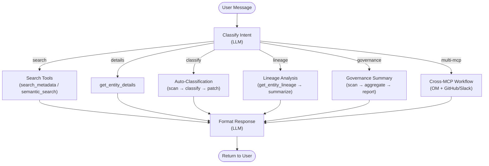
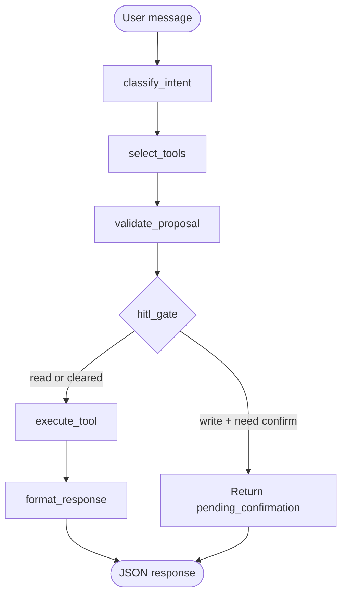
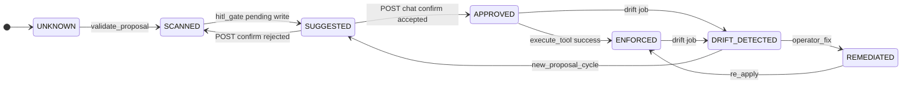

# Agent Pipeline Architecture

## Overview

The agent uses **LangGraph** to orchestrate multi-step governance workflows. Each user message triggers a graph execution that can involve multiple MCP tool calls.

## Graph Structure



The diagram above is a **conceptual** marketing view. The **shipped** graph is the six-node pipeline below.

## Implemented LangGraph (`src/copilot/services/agent.py`)

Single-turn state machine (Module G allowlist + HITL expiry per [APIContract.md](./APIContract.md)):



**`POST /api/v1/chat/confirm`** (Phase 2b, [GovernanceEngine.md](../FeatureDev/GovernanceEngine.md)) executes the deferred write and should transition governance state — it is **not** another LangGraph node in v1; it is a separate HTTP entrypoint that mutates session + MCP.

## Governance FSM hooks

**P2-20 (#76):** In-memory `governance_store` + FSM types are implemented (`get_or_create`, `transition`). **P2-21 (#77):** Wire LangGraph nodes and `POST /chat/confirm` to call `transition` as below.

When hooks land, associate transitions with nodes:



## State Schema

```python
from typing import TypedDict, Annotated, Sequence
from langgraph.graph import StateGraph

class AgentState(TypedDict):
    messages: Annotated[Sequence[dict], "Chat history"]
    intent: str                    # search, details, classify, lineage, governance
    tool_calls: list[dict]         # MCP tools invoked
    results: list[dict]            # Tool results
    response: str                  # Final formatted response
    error: str | None              # Error if any
```

> **Note:** The production `AgentState` in `agent.py` is a `TypedDict` with fields such as `tool_proposals`, `pending_confirmation`, `final_response`, and `evidence_gap` — see [DataModel.md](./DataModel.md). The simplified box above is illustrative only.

## Intent Classification

The LLM classifies user intent into one of these categories:

| Intent       | Trigger Phrases                                          | Primary Tool                             |
| ------------ | -------------------------------------------------------- | ---------------------------------------- |
| `search`     | "show me", "find", "list", "how many"                    | `search_metadata`                        |
| `discover`   | "tables about", "related to", "similar to"               | `semantic_search`                        |
| `details`    | "tell me about", "describe", "what is"                   | `get_entity_details`                     |
| `classify`   | "auto-classify", "detect PII", "tag", "scan"             | `search` → `get_entity` → `patch_entity` |
| `lineage`    | "what depends on", "impact of", "upstream", "downstream" | `get_entity_lineage`                     |
| `rca`        | "why is this broken", "root cause"                       | `root_cause_analysis`                    |
| `governance` | "governance summary", "tag coverage", "compliance"       | `search_metadata` (aggregation)          |

## Tool Invocation Pattern

```python
from langchain_mcp_adapters import MultiServerMCPClient

async def invoke_mcp_tool(client, tool_name: str, params: dict) -> dict:
    """Invoke an MCP tool with error handling and logging."""
    try:
        result = await client.call_tool(tool_name, params)
        logger.info(f"Tool {tool_name} returned {len(str(result))} chars")
        return {"success": True, "data": result}
    except AuthorizationError as e:
        return {"success": False, "error": f"Permission denied: {e}"}
    except TimeoutError:
        return {"success": False, "error": "MCP server timed out"}
    except Exception as e:
        return {"success": False, "error": str(e)}
```
