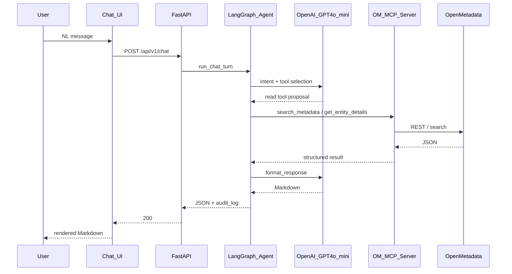
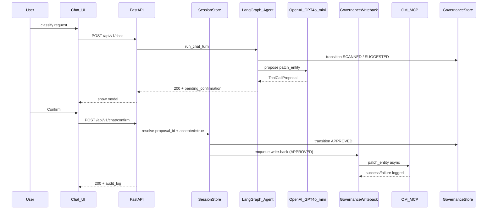
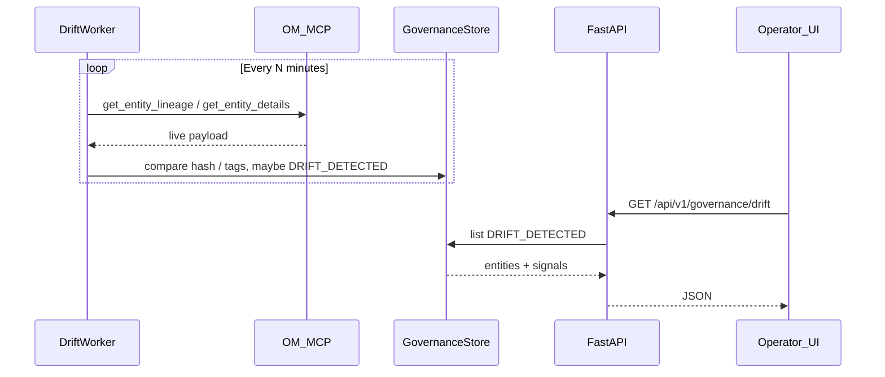
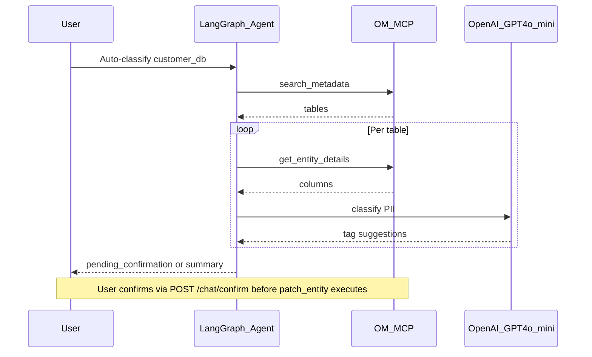
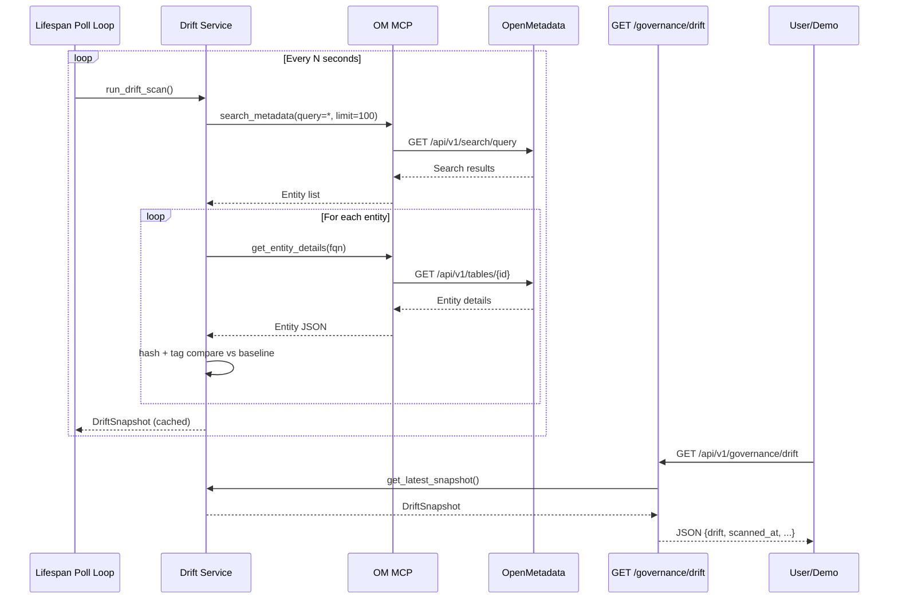

# Data Flow

> LLM in diagrams: **OpenAI GPT-4o-mini** via `langchain-openai` (see [CLAUDE.md](../../../CLAUDE.md)). HITL + governance store: [FeatureDev/GovernanceEngine.md](../FeatureDev/GovernanceEngine.md).

## End-to-end read path (search / details)

## Write path with HITL (auto-classify / patch_entity)

`POST /chat/confirm` is a **separate HTTP entry** (not a LangGraph node): it resolves pending state in `sessions`, transitions governance state, and enqueues service-layer OM write-back — see [AgentPipeline.md](./AgentPipeline.md).

## Drift detection and read API

## Auto-classification (conceptual loop)

Same as shipped design: scan → details per table → LLM classify → **HITL** → `patch_entity` (never skip confirmation for hard writes).

## Drift Detection Flow

