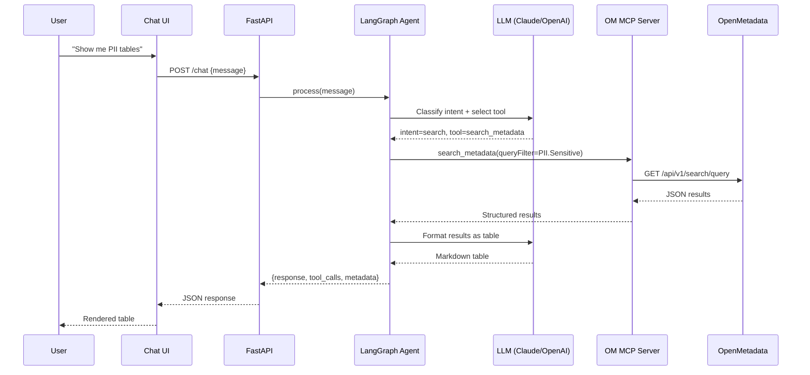
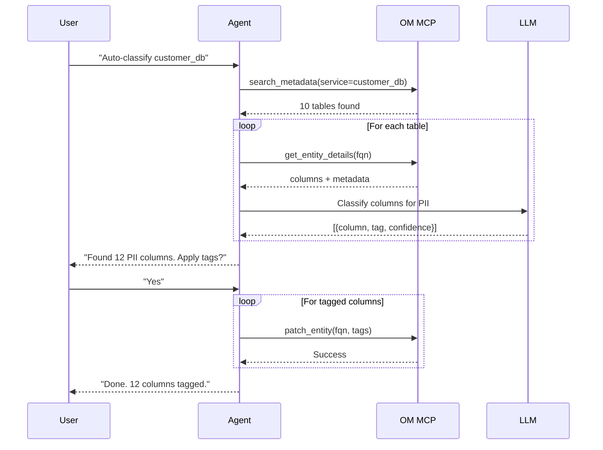

# Data Flow

## End-to-End Flow

```mermaid
sequenceDiagram
    participant U as User
    participant UI as Chat UI
    participant API as FastAPI
    participant A as LangGraph Agent
    participant LLM as LLM (Claude/OpenAI)
    participant MCP as OM MCP Server
    participant OM as OpenMetadata

    U->>UI: "Show me PII tables"
    UI->>API: POST /chat {message}
    API->>A: process(message)
    A->>LLM: Classify intent + select tool
    LLM-->>A: intent=search, tool=search_metadata
    A->>MCP: search_metadata(queryFilter=PII.Sensitive)
    MCP->>OM: GET /api/v1/search/query
    OM-->>MCP: JSON results
    MCP-->>A: Structured results
    A->>LLM: Format results as table
    LLM-->>A: Markdown table
    A-->>API: {response, tool_calls, metadata}
    API-->>UI: JSON response
    UI-->>U: Rendered table
```

## Auto-Classification Flow

```mermaid
sequenceDiagram
    participant U as User
    participant A as Agent
    participant MCP as OM MCP
    participant LLM as LLM

    U->>A: "Auto-classify customer_db"
    A->>MCP: search_metadata(service=customer_db)
    MCP-->>A: 10 tables found

    loop For each table
        A->>MCP: get_entity_details(fqn)
        MCP-->>A: columns + metadata
        A->>LLM: Classify columns for PII
        LLM-->>A: [{column, tag, confidence}]
    end

    A-->>U: "Found 12 PII columns. Apply tags?"
    U->>A: "Yes"

    loop For tagged columns
        A->>MCP: patch_entity(fqn, tags)
        MCP-->>A: Success
    end

    A-->>U: "Done. 12 columns tagged."
```
