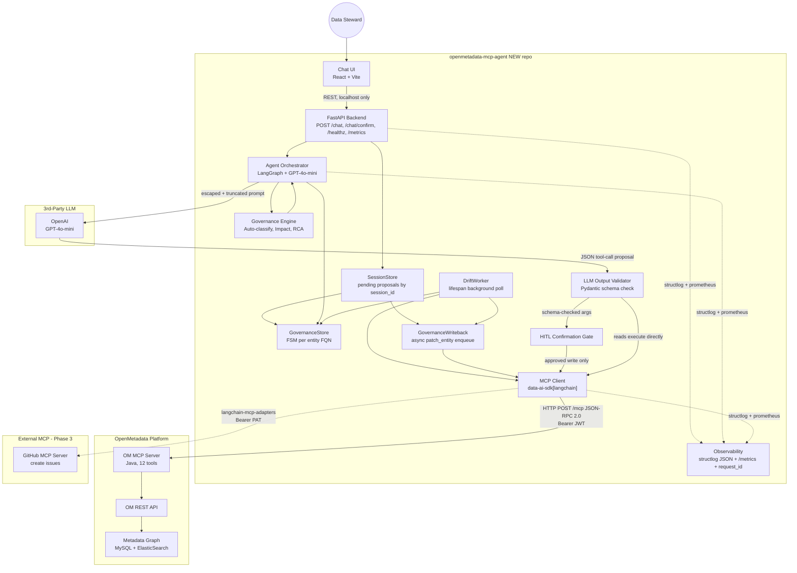
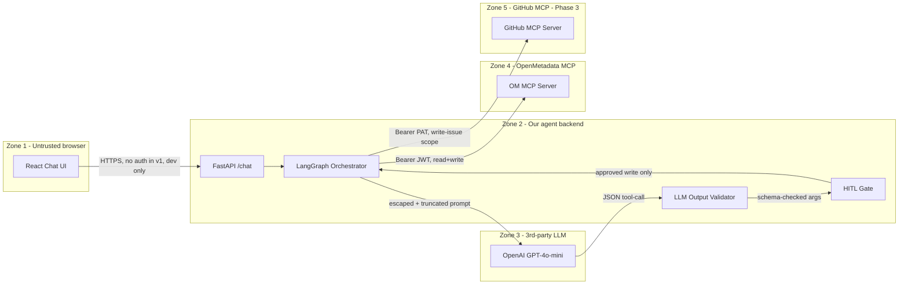

# Architecture Overview

## System Context Diagram



## Component Map

| Component                  | Technology                                           | Responsibility                                                                                                                                                                                         |
| -------------------------- | ---------------------------------------------------- | ------------------------------------------------------------------------------------------------------------------------------------------------------------------------------------------------------ |
| **Chat UI**                | React 18 + Vite 5 + TypeScript 5; OM brand `#7147E8` | User-facing chat interface; renders sanitized markdown; HITL confirmation modal                                                                                                                        |
| **FastAPI Backend**        | Python 3.11+, FastAPI 0.110+, Uvicorn 0.27+, slowapi | HTTP layer; rate limiting; request_id middleware; structured error envelope per [APIContract.md](./APIContract.md)                                                                                     |
| **Agent Orchestrator**     | LangGraph + `langchain-openai`                       | NL understanding, intent → tool selection, multi-step workflows. (`langchain-mcp-adapters` is Phase 3 only, for the GitHub MCP — OM uses `data-ai-sdk[langchain]` natively.)                           |
| **LLM Output Validator**   | Pydantic v2                                          | Every LLM JSON tool-call proposal is parsed into a `ToolCallProposal` model before execution; on parse failure, returns `llm_invalid_output` (502) per [DataModel.md](./DataModel.md)                  |
| **HITL Confirmation Gate** | Python service                                       | Every `soft_write` and `hard_write` tool call is held as `pending_confirmation`; user must accept via `POST /chat/confirm`; expires after 5 min                                                        |
| **Session Store**          | In-memory service (`sessions.py`)                    | Stores pending proposal by `session_id`; confirm/cancel resolve proposal lifecycle and clear consumed rows                                                                                                 |
| **Governance Store**       | In-memory FSM store (`governance_store.py`)          | Tracks per-FQN lifecycle transitions (`SCANNED` → `SUGGESTED` → `APPROVED` …); rejects illegal edges with typed transition errors                                                                       |
| **Governance Write-back**  | Async service (`governance_writeback.py`)            | Enqueues `patch_entity` updates on `APPROVED` / `DRIFT_DETECTED`; appends extension keys `governance_state`, `governance_approved_tags_json`, `governance_lineage_snapshot_hash`                      |
| **MCP Client**             | `data-ai-sdk[langchain]` v0.1.2+                     | Connects to OM MCP server via HTTP POST `/mcp` (JSON-RPC 2.0); Bearer JWT auth; `pybreaker` circuit breaker; `tenacity` retry; httpx timeouts per [NFRs.md](../Project/NFRs.md)                        |
| **Governance Engine**      | Python services in `src/copilot/services/`           | Auto-classification with prompt-injection escaping ([Security/PromptInjectionMitigation.md](../Security/PromptInjectionMitigation.md)), lineage→English summarizer, governance summary aggregator      |
| **Observability**          | `structlog` (JSON) + `prometheus-client`             | Structured logs with `request_id` propagation; `/metrics` exposing the 4 Golden Signals; PII-redaction processor                                                                                       |
| **OM MCP Server**          | Java (upstream, unmodified)                          | Exposes 12 tools for metadata CRUD, search, lineage; verified in [openmetadata-mcp/src/main/resources/json/data/mcp/tools.json](../../../openmetadata-mcp/src/main/resources/json/data/mcp/tools.json) |

## Trust Boundary Diagram

> Per [security-vulnerability-auditor SKILL §Phase 1.4](../../agents/security-vulnerability-auditor/SKILL.md). Five trust zones; weakest boundary called out below.



**Weakest boundary**: Zone 4 / Zone 5 writes triggered by Zone 3 output. The LLM can suggest a `patch_entity` (Zone 4) or `github_create_issue` (Zone 5) call. Mitigation: every write tool call is gated behind Zone 2 schema-validation + HITL confirmation. Detail in [Security/ThreatModel.md](../Security/ThreatModel.md) and [Security/PromptInjectionMitigation.md](../Security/PromptInjectionMitigation.md).

**Highest-risk sink**: `patch_entity` — mutates the OM catalog under bot-user permission; can change tags, owners, descriptions, lineage edges. Always `risk_level=hard_write` per [DataModel.md](./DataModel.md), always confirmation-gated.

## Data Flow

```
User types NL query
  → Chat UI sends to FastAPI /chat
    → FastAPI passes to LangGraph Agent
      → Agent decides: which MCP tool(s)?
        → MCP Client calls OM MCP Server (HTTP POST /mcp, JSON-RPC 2.0, Bearer JWT)
          → OM executes tool (search, lineage, patch, etc.)
          → Returns JSON result
        → Agent may call additional tools (multi-step)
        → Agent constructs human-readable response
      → FastAPI returns to Chat UI
    → UI renders structured response
```

## Authentication Flow

```
1. User configures OM_HOST + OM_TOKEN in .env
2. data-ai-sdk reads AI_SDK_HOST, AI_SDK_TOKEN from env
3. MCP client posts JSON-RPC 2.0 requests to `{OM_HOST}/mcp` over HTTPS
4. Every tool call includes JWT in `Authorization: Bearer <token>` header
5. OM MCP Server validates JWT, checks RBAC
6. Tool executes under user's permission context
```

## Observability Subsystem

> Per [Feature-Dev SKILL §Architect's Judgment Rule 6 — "Observability is architecture"](../../agents/Feature-Dev/SKILL.md). Not bolted on; first-class.

```
[Every code path]
  -> structlog.get_logger(__name__)
  -> bind request_id from middleware (UUID v4 per HTTP request)
  -> emit JSON line: {ts, level, event, request_id, ...kwargs}
  -> stdout (Docker captures) + rotating file logs/agent.log

[Every external call]
  -> increment counter agent_{mcp,llm,github}_calls_total{outcome}
  -> observe histogram agent_{mcp,llm}_request_latency_seconds
  -> on circuit-breaker state change: set gauge agent_circuit_breaker_state

[GET /metrics]
  -> prometheus-client text format
  -> exposes the 4 Golden Signals (Latency, Traffic, Errors, Saturation) plus token usage
  -> live demo: judges hit /metrics in browser
```

Detail in [APIContract.md §GET /api/v1/metrics](./APIContract.md). Series list in [NFRs.md §NFR-06](../Project/NFRs.md). PII redaction processor specified in [Security/SecretsHandling.md](../Security/SecretsHandling.md).

## Key Design Principles

1. **API-first**: Every data fetch goes through MCP or OM REST API — no scraping, no direct DB.
2. **Stateless agent**: Each chat query is self-contained; LangGraph handles multi-step within a single execution; in-memory state lost on restart per [DataModel.md](./DataModel.md).
3. **OM-native**: Uses official `data-ai-sdk`, official 12 MCP tools, official Bot JWT auth — not a sidecar hack.
4. **Graceful degradation**: If a tool fails, circuit breaker opens, agent returns structured error envelope per [APIContract.md](./APIContract.md), UI shows a clear message.
5. **Demo-friendly**: Every feature is testable from the chat UI; every failure mode rehearsed per [Project/Runbook.md](../Project/Runbook.md) and [Demo/FailureRecovery.md](../Demo/FailureRecovery.md).
6. **Observability is architecture**: structlog + `/metrics` + request_id are non-negotiable, present in every layer (per Feature-Dev Architect's Judgment Rule 6).
7. **Defense-in-depth at the LLM boundary**: input neutralization + Pydantic output validation + tool allowlist + HITL gate (Module G of [security-vulnerability-auditor SKILL](../../agents/security-vulnerability-auditor/SKILL.md)).
8. **Three Laws of Implementation enforced everywhere**: layer separation; handle every error path; every external call has timeout + retry + circuit breaker. See [CodingStandards.md](./CodingStandards.md).
