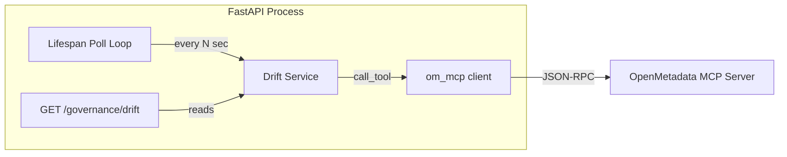

# Governance Engine

> Phase 2 deliverable. Drift detection and governance lifecycle management for OpenMetadata entities.

## Implementation Overview

The governance engine detects when live OpenMetadata entities diverge from an approved baseline ("drift") and exposes findings via a REST API endpoint. It runs as a background task in the FastAPI lifespan, polling OM at a configurable interval.

## Architecture



## Drift Signals

| Signal           | Description                                         | Detection Method                              |
| ---------------- | --------------------------------------------------- | --------------------------------------------- |
| `hash_changed`   | Entity fields (description, columns, tags) changed  | SHA-256 of canonicalised entity fields         |
| `tag_missing`    | Expected governance tag removed from entity         | Set difference: baseline tags − current tags   |
| `tag_unexpected` | New governance tag appeared that wasn't in baseline | Set difference: current tags − baseline tags   |

Governance tag prefixes monitored: `PII.`, `Tier.`, `PersonalData.`

## Components

| File                            | Layer    | Responsibility                             |
| ------------------------------- | -------- | ------------------------------------------ |
| `src/copilot/services/drift.py` | Service  | Pure drift logic: hash, tag compare, scan  |
| `src/copilot/api/governance.py` | API      | `GET /api/v1/governance/drift` route       |
| `src/copilot/api/main.py`       | API      | Lifespan poll loop (background task)       |
| `src/copilot/config/settings.py`| Config   | `drift_poll_interval_seconds` setting      |

## Configuration

| Env Var                         | Default | Description                       |
| ------------------------------- | ------- | --------------------------------- |
| `DRIFT_POLL_INTERVAL_SECONDS`   | 60.0    | Seconds between background scans |

## NFR Compliance

- **Timeout + retry**: Drift scan uses `om_mcp.call_tool` which has circuit breaker (5 failures / 30s cooldown) + retry (3 attempts, exponential backoff) per NFRs.md.
- **Crash resilience**: Poll loop catches all exceptions; never crashes the process (NFR-03).
- **Structured errors**: GET /governance/drift returns 503 with error envelope when OM is down (per APIContract.md).

## Test Coverage

- `tests/unit/test_drift.py`: Pure logic (hash, tags, detect_drift)
- `tests/unit/test_governance_api.py`: Integration tests with mocked MCP
# Governance Engine — Technical Specification

> **Status**: Plan-only contract. Implementation follows [CLAUDE.md](../../../CLAUDE.md) layer rules (API → services → clients).
> **Replaces for execution**: Informal `P0`–`P6` labels in [Task.md](../../../Task.md) — use **TaskSync `P2-19`…`P2-26`** below.
> **GitHub issues**: Every engineering issue body **must** follow [PR-Review/EngineeringIssueTemplate.md](../PR-Review/EngineeringIssueTemplate.md) (Context → What to do → Done when → Depends on → Unblocks → Acceptance criteria → References).

## Why this exists

Differentiates the project from a “search chatbot”: **per-entity governance lifecycle**, **human-in-the-loop writes**, **catalog write-back** via OpenMetadata APIs, and **drift** when reality diverges from an approved baseline. Aligns with hackathon criteria **Best Use of OpenMetadata** and **Potential Impact**.

## Canonical task ID map (Task.md → TaskSync)

| Legacy (Task.md)    | TaskSync ID | One-line scope                                                                                                                                                |
| ------------------- | ----------- | ------------------------------------------------------------------------------------------------------------------------------------------------------------- |
| P0                  | **P2-19**   | In-memory pending proposals by `session_id`; wire `POST /chat/confirm` and `POST /chat/cancel` through **services** (not direct `om_mcp` from `api/`).        |
| P1                  | **P2-20**   | `GovernanceState` enum + `ALLOWED_TRANSITIONS` + `governance_store` (`EntityGovernanceRecord` keyed by entity FQN).                                           |
| —                   | **P2-21**   | Integrate store into LangGraph nodes: `validate_proposal`, `hitl_gate`, and confirm path (transitions: scanned, suggested, approved).                         |
| P2                  | **P2-22**   | Persist selected states to OM via `patch_entity` / extension properties (async fire-and-forget with structured logging).                                      |
| P3 (service)        | **P2-23**   | `drift.py`: compare lineage hash + approved tags vs live `get_entity_lineage` / `get_entity_details`.                                                         |
| P3 (API + lifespan) | **P2-24**   | Background drift poll in FastAPI lifespan; **`GET /api/v1/governance/drift`** per [APIContract.md §Planned endpoints](../Architecture/APIContract.md).        |
| P4                  | **P2-25**   | `similarity.py`: weighted signals; optional “opinionated” line in `format_response` context when score > threshold.                                           |
| P5 + P6             | **P2-26**   | Causal / downstream impact in `format_response` for classify; `evidence_gap` on `AgentState` when no proposals — single PR acceptable, timebox humility copy. |

## Merge order (dependencies)

1. **P2-19** before **P2-01** (auto-classify): writes must not execute without working confirm/cancel + pending store.
2. **P2-20** before **P2-21** (store before agent hooks).
3. **P2-21** before **P2-22** (valid transitions before OM persistence).
4. **P2-22** optional but recommended before **P2-23** (persist baseline hash/tags for drift).
5. **P2-23** before **P2-24** (signals before exposing HTTP).
6. **P2-25** / **P2-26** can follow core HITL; timebox **P2-26** humility path if schedule slips.

## `GovernanceState` (contract)

```python
from enum import StrEnum

class GovernanceState(StrEnum):
    UNKNOWN = "unknown"
    SCANNED = "scanned"
    SUGGESTED = "suggested"
    APPROVED = "approved"
    ENFORCED = "enforced"
    DRIFT_DETECTED = "drift_detected"
    REMEDIATED = "remediated"

ALLOWED_TRANSITIONS: dict[GovernanceState, frozenset[GovernanceState]] = {
    GovernanceState.UNKNOWN: frozenset({GovernanceState.SCANNED}),
    GovernanceState.SCANNED: frozenset({GovernanceState.SUGGESTED, GovernanceState.UNKNOWN}),
    GovernanceState.SUGGESTED: frozenset({GovernanceState.APPROVED, GovernanceState.SCANNED}),
    GovernanceState.APPROVED: frozenset({GovernanceState.ENFORCED, GovernanceState.DRIFT_DETECTED}),
    GovernanceState.ENFORCED: frozenset({GovernanceState.DRIFT_DETECTED}),
    GovernanceState.DRIFT_DETECTED: frozenset({GovernanceState.REMEDIATED, GovernanceState.SUGGESTED}),
    GovernanceState.REMEDIATED: frozenset({GovernanceState.ENFORCED}),
}
```

`governance_store.transition(fqn, new_state, evidence)` raises on illegal transitions; `get_or_create(fqn)` seeds `UNKNOWN`.

**Implementation (P2-20 / #76):** `GovernanceState` + `ALLOWED_TRANSITIONS` — [`src/copilot/models/governance_state.py`](../../src/copilot/models/governance_state.py); `EntityGovernanceRecord` — [`src/copilot/models/governance_record.py`](../../src/copilot/models/governance_record.py); store — [`src/copilot/services/governance_store.py`](../../src/copilot/services/governance_store.py). Confirm-path and graph hooks remain **#77**.

## Session proposals (P2-19)

- **Store**: `Dict[str, PendingSession]` or `Dict[UUID, ...]` keyed by `session_id` string; value holds `pending: ToolCallProposal | None`, `expires_at`.
- **`POST /chat/confirm`**: Service loads proposal by `(session_id, proposal_id)`; if `accepted`, transition `governance_store` to `APPROVED`, enqueue async OM write-back (`services/governance_writeback.py`), then clear pending. If rejected, clear pending and return cancellation copy per [APIContract.md](../Architecture/APIContract.md).
- **`POST /chat/cancel`**: Clear session pending + any ephemeral LangGraph checkpoint if introduced later.
- **Errors**: `proposal_not_found`, `confirmation_expired` — already in contract.

## OM write-back (P2-22)

- On transition to **`APPROVED`** or **`DRIFT_DETECTED`**, enqueue async task to patch entity custom/extension fields using validated `patch_entity` args.
- Suggested property keys (string values): `governance_state`, `governance_lineage_snapshot_hash`, `governance_approved_tags_json` (or equivalent).
- **References**: [OpenMetadata REST / metadata APIs](https://docs.open-metadata.org/) — verify field names against deployed OM 1.6.x.

## Drift (P2-23 / P2-24)

- **Signals** (non-exhaustive): lineage structure/hash change vs stored snapshot; approved tags missing from live entity.
- **Poll interval**: configurable (e.g. 10 minutes), NFR-aligned timeouts on each MCP call.
- **Endpoint**: `GET /api/v1/governance/drift` returns list of FQNs (and optional signal detail) for entities in `DRIFT_DETECTED`.

## Similarity (P2-25)

- **Inputs**: candidate table FQN; corpus of prior approved entities from `governance_store`.
- **Signals** (example weights, tune in implementation): column name overlap **0.5**; lineage Jaccard upstream overlap **0.3**; glossary term co-occurrence **0.2**.
- **Output**: score in `[0,1]`; if **> 0.85**, add short “opinionated” clause to LLM context in `format_response` (still subject to HITL for writes).

## Causal impact + epistemic humility (P2-26)

**Causal:** When `intent == "classify"` (or lineage-heavy flows), compute downstream counts / Tier-1 exposure from `get_entity_lineage` (truncated, redacted per `prompt_safety`). Append structured bullet block to model context so the assistant explains **what breaks if untagged**.

**Humility:** Add optional `evidence_gap: bool` on `AgentState` (see [DataModel.md](../Architecture/DataModel.md)). Set when `intent == "classify"` and `tool_proposals` is empty after validation. `format_response` instructs the model to state missing glossary/terms or insufficient catalog signal — no fabricated tags.

## Sixteen-issue GitHub budget (repo work)

Live index: [SPRINT16_GITHUB_ISSUES.md](../SPRINT16_GITHUB_ISSUES.md) (GitHub **#75–#90**).

| #   | GitHub                                                                   | Title                                  | Scope                                                                                                                               | Primary owner |
| --- | ------------------------------------------------------------------------ | -------------------------------------- | ----------------------------------------------------------------------------------------------------------------------------------- | ------------- |
| 1   | [#75](https://github.com/GunaPalanivel/openmetadata-mcp-agent/issues/75) | Session store + confirm/cancel         | P2-19                                                                                                                               | GSA           |
| 2   | [#76](https://github.com/GunaPalanivel/openmetadata-mcp-agent/issues/76) | GovernanceState FSM + governance_store | P2-20                                                                                                                               | GSA           |
| 3   | [#77](https://github.com/GunaPalanivel/openmetadata-mcp-agent/issues/77) | Agent hooks + OM write-back            | P2-21, P2-22                                                                                                                        | PSTL          |
| 4   | [#78](https://github.com/GunaPalanivel/openmetadata-mcp-agent/issues/78) | Drift service + poll + GET drift       | P2-23, P2-24                                                                                                                        | GSA           |
| 5   | [#79](https://github.com/GunaPalanivel/openmetadata-mcp-agent/issues/79) | Agent UX hardening                     | P2-25, P2-26                                                                                                                        | PSTL          |
| 6   | [#80](https://github.com/GunaPalanivel/openmetadata-mcp-agent/issues/80) | Auto-classification flow               | P2-01                                                                                                                               | GSA           |
| 7   | [#81](https://github.com/GunaPalanivel/openmetadata-mcp-agent/issues/81) | Lineage impact analysis                | P2-02                                                                                                                               | PSTL          |
| 8   | [#82](https://github.com/GunaPalanivel/openmetadata-mcp-agent/issues/82) | NL query engine                        | P2-06                                                                                                                               | PSTL          |
| 9   | [#83](https://github.com/GunaPalanivel/openmetadata-mcp-agent/issues/83) | React UI → FastAPI                     | P2-10                                                                                                                               | ATL           |
| 10  | [#84](https://github.com/GunaPalanivel/openmetadata-mcp-agent/issues/84) | HITL confirmation modal                | P2-12                                                                                                                               | ATL           |
| 11  | [#85](https://github.com/GunaPalanivel/openmetadata-mcp-agent/issues/85) | OM-native UI + governance dashboard    | P3-10, P3-11                                                                                                                        | ATL           |
| 12  | [#86](https://github.com/GunaPalanivel/openmetadata-mcp-agent/issues/86) | Multi-MCP GitHub + cross workflow      | P3-01, P3-02                                                                                                                        | BSE           |
| 13  | [#87](https://github.com/GunaPalanivel/openmetadata-mcp-agent/issues/87) | Integration + security gates           | P2-09, P2-10b, P3-08                                                                                                                | BSE           |
| 14  | [#88](https://github.com/GunaPalanivel/openmetadata-mcp-agent/issues/88) | CI vs CIHardening                      | P3-09 (repo [.github/workflows/ci.yml](../../../.github/workflows/ci.yml) vs [Security/CIHardening.md](../Security/CIHardening.md)) | BSE           |
| 15  | [#89](https://github.com/GunaPalanivel/openmetadata-mcp-agent/issues/89) | Demo seed + rehearsal automation       | P2-13b, P3-14-P3-16 code                                                                                                            | BSE           |
| 16  | [#90](https://github.com/GunaPalanivel/openmetadata-mcp-agent/issues/90) | E2E Playwright + Judge Moment 3        | P2-13 + [JudgePersona.md](../Project/JudgePersona.md)                                                                               | ATL           |

**Docs / README / submission** (P3-17, P3-19, P4-04, P4-05) are **outside** the 16-issue engineering count — track in [TaskSync.md](../TaskSync.md) Phase 3–4.

## Upstream contribution track (parallel, not counted in 16)

- **Hackathon repo** (`openmetadata-mcp-agent`): full agent, judges run here.
- **Upstream-ready**: at least one **small, reviewable** PR to `open-metadata/OpenMetadata` (GFI or docs) from the team fork per [DataFindings/GoodFirstIssues.md](../DataFindings/GoodFirstIssues.md) — see [Project/PRD.md §Upstream contribution vs hackathon deliverable](../Project/PRD.md). The agent codebase does **not** merge wholesale into OM core.

## Judge validation script (post-implementation)

1. Load seed OM; open UI; run classify intent; receive `pending_confirmation`.
2. **Approve** → verify `patch_entity` success in audit log **and** custom property visible on entity in OM UI.
3. Manually remove a tag or alter lineage in OM; wait for drift poll **or** trigger manual drift check if exposed for demo.
4. Call **`GET /api/v1/governance/drift`** → entity listed with `DRIFT_DETECTED`.
5. Reject path: new proposal → reject → no write; session clear on cancel.

## Related documents

- [Architecture/APIContract.md](../Architecture/APIContract.md) — chat + planned drift route
- [Architecture/DataModel.md](../Architecture/DataModel.md) — `EntityGovernanceRecord`, `AgentState` extensions
- [Architecture/AgentPipeline.md](../Architecture/AgentPipeline.md) — node + FSM diagram
- [Demo/Narrative.md](../Demo/Narrative.md) — scripted demo
- [Project/JudgePersona.md](../Project/JudgePersona.md) — judge moments
