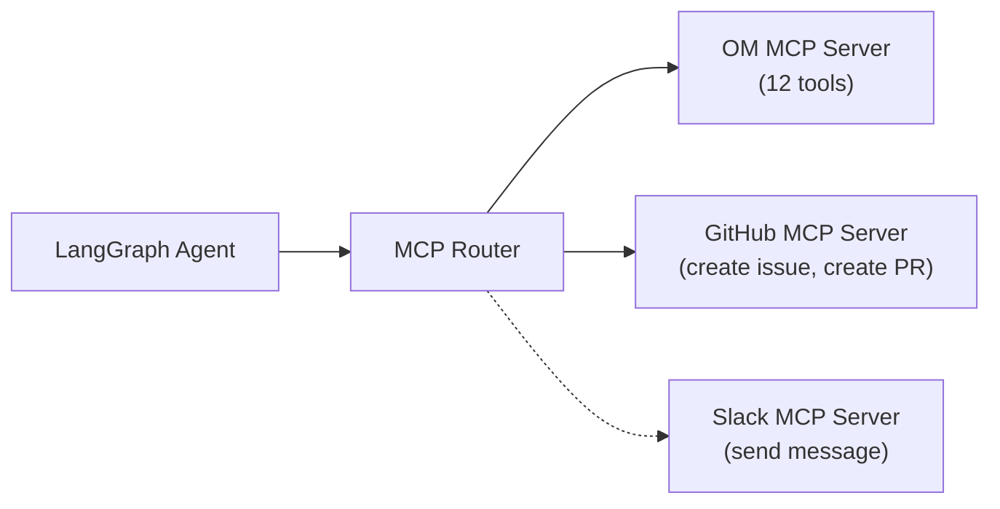

# Multi-MCP Orchestrator Feature Spec

## Owner: OMH-GSA (Guna)
## Phase: 3 (Day 8–9) — Stretch

---

## Overview

Connect to multiple MCP servers simultaneously — OpenMetadata + GitHub (or Slack). Enable cross-platform governance workflows.

## Target Issue

[#26645: Multi-MCP Agent Orchestrator](https://github.com/open-metadata/OpenMetadata/issues/26645)

## Architecture



## Cross-MCP Workflow Example

```
User: "Find all tables with PII and create GitHub issues for each untagged one"
→ Step 1: search_metadata(queryFilter=PII.Sensitive) via OM MCP
→ Step 2: For untagged tables → create_issue(title="PII found in {table}", body="...") via GitHub MCP
→ Response: "Created 3 GitHub issues for untagged PII tables."
```

## Implementation

```python
# src/copilot/clients/github_mcp.py
# Proxy client that mocks GitHub API calls for the hackathon demo

def call_tool(name: str, arguments: dict[str, Any]) -> dict[str, Any]:
    if name == "github_create_issue":
        # Check settings.github_token
        # Return mock issue URL
        return {"issue_url": f"https://github.com/{repo}/issues/123", ...}
```

```python
# src/copilot/services/agent.py
# Route tool execution to the appropriate client

if proposal.tool_name == ToolName.GITHUB_CREATE_ISSUE:
    from copilot.clients import github_mcp
    result = await asyncio.to_thread(
        github_mcp.call_tool, str(proposal.tool_name), proposal.arguments
    )
else:
    result = await asyncio.to_thread(
        om_mcp.call_tool, str(proposal.tool_name), proposal.arguments
    )
```

## Priority

This was a **stretch goal** for Phase 3, completed using a mocked client strategy to satisfy hackathon constraints while demonstrating cross-MCP orchestration workflows.
