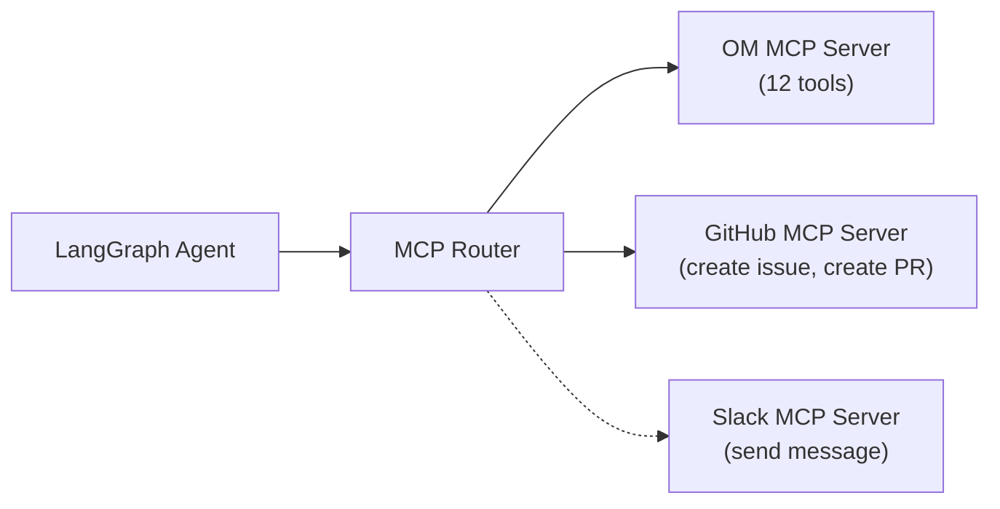

# Multi-MCP Orchestrator Feature Spec

## Owner: OMH-GSA (Guna)
## Phase: 3 (Day 8–9) — Stretch

---

## Overview

Connect to multiple MCP servers simultaneously — OpenMetadata + GitHub (or Slack). Enable cross-platform governance workflows.

## Target Issue

[#26645: Multi-MCP Agent Orchestrator](https://github.com/open-metadata/OpenMetadata/issues/26645)

## Architecture



## Cross-MCP Workflow Example

```
User: "Find all tables with PII and create GitHub issues for each untagged one"
→ Step 1: search_metadata(queryFilter=PII.Sensitive) via OM MCP
→ Step 2: For untagged tables → create_issue(title="PII found in {table}", body="...") via GitHub MCP
→ Response: "Created 3 GitHub issues for untagged PII tables."
```

## Implementation

```python
from langgraph.prebuilt import ToolNode
from langchain_mcp_adapters import MultiServerMCPClient

# Connect to multiple MCP servers
async with MultiServerMCPClient({
    "openmetadata": {
        "url": f"{OM_HOST}/mcp",
        "transport": "sse",
        "headers": {"Authorization": f"Bearer {OM_TOKEN}"}
    },
    "github": {
        "command": "npx",
        "args": ["-y", "@modelcontextprotocol/server-github"],
        "env": {"GITHUB_TOKEN": GITHUB_TOKEN},
        "transport": "stdio"
    }
}) as client:
    tools = client.get_tools()
    # Agent has access to all tools from both servers
```

## Priority

This is a **stretch goal** for Phase 3. If Phase 2 core features are not solid, skip this and focus on polish.
