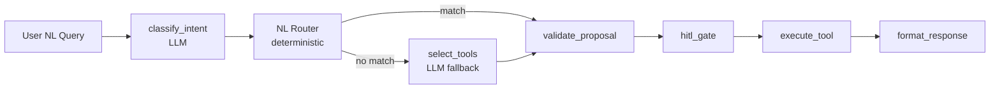

# NL Query Engine Feature Spec

## Owner: OMH-PSTL (Priyanka)
## Phase: 2 (Day 5–7)

---

## Overview

Translate natural language queries into the correct MCP tool calls, execute them, and return structured, human-readable responses.

## Architecture



The NL router (`src/copilot/services/nl_router.py`) provides a **deterministic fast-path** that maps common query patterns to the correct MCP tool without an LLM call. This reduces latency, cost, and non-determinism for the most frequent query types.

Queries that don't match any pattern fall through to the LLM-based tool selector.

## Routing Matrix

| Pattern | Tool | Example |
|---------|------|---------|
| Keyword / filter queries | `search_metadata` | "Show me tier 1 tables" |
| "Tell me about X" / "What is X?" | `get_entity_details` | "What is dim_customers?" |
| Upstream / downstream / depends | `get_entity_lineage` | "What depends on orders?" |
| Conceptual / vague queries | `semantic_search` | "Tables about revenue" |
| Root cause / failures | `root_cause_analysis` | "What's broken?" |
| Classify / tag (ambiguous) | *LLM fallback* | "Auto-classify PII columns" |
| Glossary / metric / test | *LLM fallback* | "Create a glossary term" |

## User Flow Examples

```
User: "Show me all tables owned by the data-eng team"
→ Router: search_metadata (keyword match, no LLM needed)
→ Returns: formatted table with name, FQN, service, tier

User: "Find tables related to customer purchase behavior"
→ Router: semantic_search (conceptual query, not keyword)
→ Returns: ranked results with similarity scores

User: "Tell me about the orders table"
→ Router: get_entity_details (entity details pattern)
→ Returns: columns, tags, owners, description, service

User: "What depends on customer_db.public.users?"
→ Router: get_entity_lineage (lineage pattern)
→ Returns: upstream/downstream graph

User: "Auto-classify PII columns in customer_db"
→ Router: no match → LLM fallback selects patch_entity
→ HITL gate: confirmation required (hard_write)
```

## Response Formatting

All responses rendered as structured Markdown:

```markdown
### Search Results (12 found)

| # | Name | Service | Tier | Tags |
|---|------|---------|------|------|
| 1 | customers | BigQuery | Tier1 | PII.Sensitive |
| 2 | orders | Snowflake | Tier2 | — |

> 💡 Use "tell me about <name>" to get full details.
```

## MCP Tools Used

| Scenario | Tool | Key Params |
|----------|------|------------|
| Keyword search | `search_metadata` | `query`, `entityType`, `queryFilter` |
| Conceptual search | `semantic_search` | `query`, `filters`, `threshold` |
| Entity details | `get_entity_details` | `entityType`, `fqn` |
| Lineage query | `get_entity_lineage` | `entityType`, `fqn`, `upstreamDepth`, `downstreamDepth` |

## Implementation

| File | Purpose |
|------|---------|
| `src/copilot/services/nl_router.py` | Deterministic NL → tool routing (regex patterns, FQN extraction) |
| `src/copilot/services/agent.py` | select_tools node: fast-path router → LLM fallback |
| `tests/unit/test_nl_router.py` | 47 routing matrix unit tests |
| `tests/unit/test_agent.py` | Updated agent tests (router integration) |

## Error Handling

- No results → "No results found. Try a broader search or different keywords."
- Ambiguous query → "Did you mean: [option A] or [option B]?"
- Auth failure → "You don't have permission to view this entity."
- MCP timeout → Retry 2x, then "OpenMetadata server is not responding. Please try again."

## Test Cases

1. "Show me tier 1 tables" → `search_metadata` with tier filter → results ✅
2. "Tables about revenue" → `semantic_search` → ranked results ✅
3. "What is dim_customers?" → `get_entity_details` → full entity ✅
4. "How many tables in BigQuery?" → `search_metadata` with aggregation → count ✅
5. Empty result → graceful message ✅
6. "What depends on X?" → `get_entity_lineage` ✅
7. "What's broken?" → `root_cause_analysis` ✅
8. Classify intent → LLM fallback ✅
