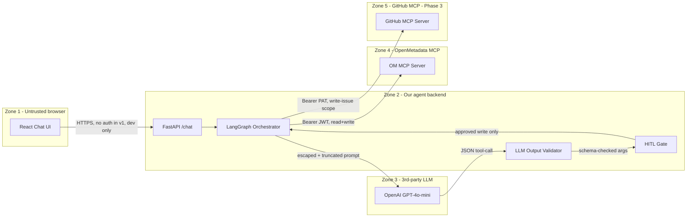

<!-- markdownlint-disable MD033 MD041 -->

<p align="center">
  <strong>openmetadata-mcp-agent</strong><br/>
  <em>Conversational governance agent for OpenMetadata.</em>
</p>

<p align="center">
  <a href="https://github.com/GunaPalanivel/openmetadata-mcp-agent/actions"></a>
  <a href="https://github.com/GunaPalanivel/openmetadata-mcp-agent/blob/main/LICENSE"></a>
  
  
</p>

> **OpenMetadata's mission is to take the chaos out of the data practitioner's life.** Today most of that chaos is the _governance loop_: scan, classify, confirm, apply, notify. We turned that loop into one chat sentence — with a human-in-the-loop safety gate, prompt-injection defense, and observability built in.

<p align="center">
  <em>(Hero GIF lands here in Phase 3 — 8s loop showing: type query → agent reasons → confirmation modal → tags applied)</em>
</p>

---

## What this is

A standalone Python conversational agent that lets a data steward govern an OpenMetadata catalog through natural language:

```
You: auto-classify PII in customer_db
Agent: [scans 50 tables]
       Found 12 PII candidates across 5 tables. Review and confirm:
         users.email          PII.Sensitive  conf 0.97
         orders.shipping_addr PII.Sensitive  conf 0.84
         ... 10 more
       [SUSPICIOUS] attack.injected_col PII.Sensitive conf 0.81
         note: column description contained instruction-injection
               pattern (neutralized before classification)
You: [Confirm]
Agent: Done. Tagged 12 columns as PII.Sensitive across 5 tables in 47s.
       Cost: $0.04. View audit log: GET /api/v1/chat/sessions/{id}
```

Built on OpenMetadata's official Python SDK ([`data-ai-sdk`](https://pypi.org/project/data-ai-sdk/)) + [LangGraph](https://langchain-ai.github.io/langgraph/) + [OpenAI GPT-4o-mini](https://platform.openai.com/docs/models). Submitted to the **WeMakeDevs × OpenMetadata "Back to the Metadata" hackathon** (April 17–26, 2026), Track T-01: MCP Ecosystem & AI Agents. Targets issues [#26645](https://github.com/open-metadata/OpenMetadata/issues/26645) (Multi-MCP Orchestrator) and [#26608](https://github.com/open-metadata/OpenMetadata/issues/26608) (Conversational Data Catalog Chat App).

---

## Quick start

```bash
# 1. Clone
git clone https://github.com/GunaPalanivel/openmetadata-mcp-agent.git
cd openmetadata-mcp-agent

# 2. Bring up OpenMetadata (Docker; assumes Docker Desktop running, 8 GB RAM)
make om-start
# or: docker compose -f infrastructure/docker-compose.om.yml up -d

# 3. Configure secrets (template → .env; then replace placeholders — app validates on startup)
make setup
# Edit .env: real AI_SDK_TOKEN (Bot JWT) and OPENAI_API_KEY (sk-...)

# 4. Install + run
make install_dev_env
make demo
# Backend → http://127.0.0.1:8000  (FastAPI docs at /api/v1/docs)
# UI      → http://localhost:3000
```

UI-only quickstart and P1-14 checklist: [ui/README.md](ui/README.md). Full step-by-step including how to generate the OpenMetadata Bot JWT: [docs/getting-started.md](docs/getting-started.md).

---

## Architecture



**Five trust zones, three-layer defense for every LLM-suggested write**: input neutralization (Layer 1), Pydantic output validation (Layer 3), tool allowlist (Layer 4), HITL confirmation gate (Layer 5). Detail in [`docs/architecture.md`](docs/architecture.md) and the internal threat model at [`.idea/Plan/Security/ThreatModel.md`](.idea/Plan/Security/ThreatModel.md).

---

## All 12 MCP tools exercised

We use the official `data-ai-sdk`'s typed `MCPTool` enum for the 7 wrapped tools, and `client.mcp.call_tool(name, args)` for the 5 string-callable ones. Source of truth: [`openmetadata-mcp/.../tools.json`](https://github.com/open-metadata/OpenMetadata/blob/main/openmetadata-mcp/src/main/resources/json/data/mcp/tools.json) (12 entries verified).

| #   | Tool                   | How we use it                                |
| --- | ---------------------- | -------------------------------------------- |
| 1   | `search_metadata`      | NL → OpenSearch DSL; governance scanning     |
| 2   | `semantic_search`      | Conceptual data discovery                    |
| 3   | `get_entity_details`   | Column inspection for classification         |
| 4   | `get_entity_lineage`   | Impact analysis (3 hops both directions)     |
| 5   | `create_glossary`      | Auto-generate governance glossaries          |
| 6   | `create_glossary_term` | Auto-generate governance terms               |
| 7   | `create_lineage`       | Document discovered relationships            |
| 8   | `patch_entity`         | **Apply PII tags, tier labels (HITL-gated)** |
| 9   | `get_test_definitions` | DQ test catalog lookup                       |
| 10  | `create_test_case`     | Data quality automation                      |
| 11  | `create_metric`        | Governance KPIs                              |
| 12  | `root_cause_analysis`  | DQ failure explanation                       |

---

## Tech stack

- **Backend**: Python 3.11+, FastAPI, Uvicorn, Pydantic v2
- **Agent**: LangGraph + langchain-openai
- **MCP Client**: `data-ai-sdk[langchain]` (official OpenMetadata Python SDK)
- **LLM**: OpenAI GPT-4o-mini
- **Resilience**: httpx + tenacity (retry) + pybreaker (circuit breaker) + slowapi (rate limit)
- **Observability**: structlog (JSON) + prometheus-client + request_id propagation
- **Frontend**: React 18 + Vite 5 + TypeScript 5 (strict mode, no `any`, no MUI)
- **Testing**: pytest + pytest-asyncio + respx + Playwright (E2E)
- **Lint/Type**: ruff + mypy --strict
- **Security scanning**: pip-audit + bandit + gitleaks
- **CI**: GitHub Actions (read-all default permissions, SHA-pinned actions, dependabot)
- **License**: Apache 2.0

Full per-layer rationale: [`.idea/Plan/Project/TechStackDR.md`](.idea/Plan/Project/TechStackDR.md).

---

## Project structure

```
openmetadata-mcp-agent/
├── src/copilot/
│   ├── api/             ← FastAPI routes (HTTP layer ONLY)
│   ├── services/        ← Business logic (agent orchestration, classification, prompt safety)
│   ├── clients/         ← External system clients (OM MCP, OpenAI, GitHub MCP)
│   ├── models/          ← Pydantic v2 models (chat session, tool proposals, audit log)
│   ├── middleware/      ← request_id, rate-limit, error envelope
│   ├── config/          ← Pydantic Settings
│   └── observability/   ← structlog + prometheus + redaction processor
├── tests/{unit,integration,e2e,security,architecture}/
├── ui/                  ← React + Vite chat UI
├── seed/                ← Frozen demo dataset (50+ tables)
├── docs/                ← Public documentation
├── infrastructure/      ← docker-compose for local OM + agent
├── scripts/             ← seed loader, smoke tests, benchmark harness
├── .github/workflows/   ← CI (lint, types, tests, security scan, secret scan)
├── .idea/Plan/          ← Internal planning docs (mostly published; tactical files private)
├── CLAUDE.md            ← Top-level architecture contract for AI agents
├── CodePatterns.md      ← Code conventions (mirrors OpenMetadata patterns)
├── pyproject.toml
├── Makefile
└── README.md
```

---

## Internal planning docs (`.idea/Plan/`)

This repo publishes most of its internal planning docs as a strong signal of engineering maturity. Browse them to see the engineering process:

- [`.idea/Plan/Project/PRD.md`](.idea/Plan/Project/PRD.md) — Product Requirements Document
- [`.idea/Plan/Project/Discovery.md`](.idea/Plan/Project/Discovery.md) — V1 Success Metric, Sensitive Data, Availability target
- [`.idea/Plan/Project/NFRs.md`](.idea/Plan/Project/NFRs.md) — Non-functional requirements + The 5 Things AI Never Adds (with concrete numbers)
- [`.idea/Plan/Project/TechStackDR.md`](.idea/Plan/Project/TechStackDR.md) — Tech Stack Decision Record
- [`.idea/Plan/Project/Decisions.md`](.idea/Plan/Project/Decisions.md) — Architecture Decision Records (ADR-01..08)
- [`.idea/Plan/Project/RiskRegister.md`](.idea/Plan/Project/RiskRegister.md) — Top 10 risks + mitigations
- [`.idea/Plan/Project/Runbook.md`](.idea/Plan/Project/Runbook.md) — Operations + 8 failure modes
- [`.idea/Plan/Project/VisionAlignment.md`](.idea/Plan/Project/VisionAlignment.md) — How we map to Collate's mission
- [`.idea/Plan/Architecture/Overview.md`](.idea/Plan/Architecture/Overview.md) — System context + trust boundaries
- [`.idea/Plan/Architecture/DataModel.md`](.idea/Plan/Architecture/DataModel.md) — Pydantic models
- [`.idea/Plan/Architecture/APIContract.md`](.idea/Plan/Architecture/APIContract.md) — Full FastAPI surface
- [`.idea/Plan/Architecture/CodingStandards.md`](.idea/Plan/Architecture/CodingStandards.md) — The Three Laws of Implementation
- [`.idea/Plan/Architecture/CodePatterns.md`](.idea/Plan/Architecture/CodePatterns.md) — Conventions (canonical source for `CodePatterns.md` in repo root)
- [`.idea/Plan/Security/ThreatModel.md`](.idea/Plan/Security/ThreatModel.md) — SC-N claims, ENTRY-N entrypoints
- [`.idea/Plan/Security/PromptInjectionMitigation.md`](.idea/Plan/Security/PromptInjectionMitigation.md) — Module G five-layer defense
- [`.idea/Plan/Security/ControlCoverage.md`](.idea/Plan/Security/ControlCoverage.md) — 9-area control matrix
- [`.idea/Plan/Security/SecretsHandling.md`](.idea/Plan/Security/SecretsHandling.md) — `AI_SDK_TOKEN`, `OPENAI_API_KEY`, `GITHUB_TOKEN` policy
- [`.idea/Plan/Security/CIHardening.md`](.idea/Plan/Security/CIHardening.md) — GitHub Actions hardening
- [`.idea/Plan/Validation/QualityGates.md`](.idea/Plan/Validation/QualityGates.md) — Per-phase exit gates
- [`.idea/Plan/Validation/PRR.md`](.idea/Plan/Validation/PRR.md) — Production Readiness Review (hackathon-scoped)
- [`.idea/Plan/TaskSync.md`](.idea/Plan/TaskSync.md) — Live task tracker

A small subset (8 tactical/sensitive files) stay private to protect the demo and avoid competitor-shaming.

---

## Team — "The Mavericks"

| Name           | GitHub                                                             | Role                  |
| -------------- | ------------------------------------------------------------------ | --------------------- |
| Guna Palanivel | [@GunaPalanivel](https://github.com/GunaPalanivel)                 | Architect / Tech Lead |
| Priyanka Sen   | [@PriyankaSen0902](https://github.com/PriyankaSen0902)             | Senior Builder        |
| Aravind Sai    | [@aravindsai003](https://github.com/aravindsai003)                 | Builder / Validator   |
| Bhawika Kumari | [@5009226-bhawikakumari](https://github.com/5009226-bhawikakumari) | Delivery / Docs       |

---

## AI Disclosure

Built with **OpenAI GPT-4o-mini** via **LangGraph** + **`data-ai-sdk`**. Free OpenAI API credits via Codex Hackathon Bengaluru promotion. AI agents (Claude / Cursor) used during development per the architectural contract in [`CLAUDE.md`](CLAUDE.md).

---

## Contributing

See [`CONTRIBUTING.md`](CONTRIBUTING.md) for branch naming, commit style, PR review process. Code conventions in [`CodePatterns.md`](CodePatterns.md). Security policy in [`SECURITY.md`](SECURITY.md).

---

## License

Apache 2.0 — matches OpenMetadata upstream. See [`LICENSE`](LICENSE).
