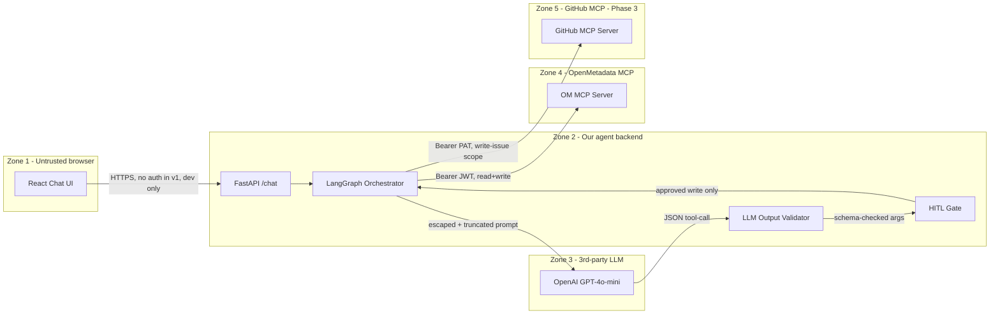

# Architecture

## System context



**Five trust zones**, three independent gates between LLM output and any write to OpenMetadata:

1. Pydantic schema validation (`ToolCallProposal.model_validate`)
2. Server-side tool allowlist (`services/agent.py::ALLOWED_TOOLS`)
3. Human-in-the-loop confirmation (`POST /api/v1/chat/confirm`)

## Layered package structure

```
src/copilot/
|-- api/             HTTP layer ONLY: routing, request parsing, response shaping
|-- services/        Business logic: orchestration, classification, prompt safety
|-- clients/         External system clients: data-ai-sdk (OM), openai, github_mcp
|-- models/          Pydantic v2 models: chat session, tool proposals, audit log
|-- middleware/      request_id, rate-limit, error envelope
|-- config/          Pydantic Settings, env loading
`-- observability/   structlog (JSON) + prometheus + redaction processor
```

Layer rules (enforced by `tests/architecture/test_layer_imports.py`):

- `api/` may call `services/`. Never `clients/`.
- `services/` may call `clients/` and `models/`. Never raises HTTP types.
- `clients/` are the only place external SDK calls happen.

See [`CodePatterns.md`](../CodePatterns.md) section 7 (Method/function size) and section 9 (No code duplication) for the per-function bar.

## Data flow (chat request)

```
[POST /api/v1/chat with user_message]
  -> RequestIdMiddleware: bind UUID to structlog.contextvars
  -> Rate limiter (slowapi): 30 req/min per IP
  -> ChatRequest (Pydantic validation)
  -> services.agent.run_chat_turn()
       -> LangGraph state machine:
            -> classify_intent (LLM call via clients/openai_client)
            -> select_tool      (LLM call)
            -> validate         (Pydantic ToolCallProposal.model_validate)
            -> if risk_level == READ:
                  execute, append ToolCallRecord
               if risk_level in {SOFT_WRITE, HARD_WRITE}:
                  store as session.pending_confirmation
                  return 200 with confirmation_required envelope
            -> [POST /chat/confirm with proposal_id + accepted=True/False]
                  -> if accepted: execute, append ToolCallRecord
                  -> if not: append rejection record
       -> compose final markdown response
  -> 200 response: {request_id, response, audit_log[], tokens_used}
```

## Authentication

| Phase | Browser -> FastAPI | FastAPI -> OM MCP | FastAPI -> OpenAI | FastAPI -> GitHub MCP |
|-------|---------------------|--------------------|--------------------|------------------------|
| v1 (hackathon) | None (loopback only) | Bot JWT (`AI_SDK_TOKEN`) | API key (`OPENAI_API_KEY`) | PAT (`GITHUB_TOKEN`, Phase 3 only) |
| v2 (roadmap) | OM OAuth callback | Per-user JWT (impersonation) | Same | Same |

## Observability

Every request gets a UUID `request_id` propagated end-to-end:

- structlog binds it to `contextvars` so every log line in the same request includes it
- The middleware sets `X-Request-Id` on the response
- Prometheus metrics include the same data dimensions per `GET /api/v1/metrics`

The 4 Golden Signals + token usage + circuit-breaker state are exposed at `/api/v1/metrics`. See [`docs/api.md`](api.md) for the full series list.

## Resilience

Per `[.idea/Plan/Project/NFRs.md](../.idea/Plan/Project/NFRs.md)`, every external call has timeout + retry + circuit breaker:

| Call | Timeout | Retries | Circuit |
|------|---------|---------|---------|
| OpenMetadata MCP | 5.0s | 3, exp backoff with jitter | open after 5 failures, 30s cooldown |
| OpenAI | 8.0s | 2 | open after 5 failures, 60s cooldown |
| GitHub MCP (Phase 3) | 5.0s | 2 | open after 3 failures, 60s cooldown |

When a circuit opens, the response is a structured error envelope (`om_unavailable` / `llm_unavailable` / `github_unavailable`). The chat UI shows a clear message rather than crashing.

## Internal planning docs

Most of `.idea/Plan/` is published in this repo. Highlights:

- [`.idea/Plan/Architecture/Overview.md`](../.idea/Plan/Architecture/Overview.md) — Internal architecture overview
- [`.idea/Plan/Architecture/DataModel.md`](../.idea/Plan/Architecture/DataModel.md) — Pydantic shapes
- [`.idea/Plan/Architecture/APIContract.md`](../.idea/Plan/Architecture/APIContract.md) — Full FastAPI surface
- [`.idea/Plan/Security/ThreatModel.md`](../.idea/Plan/Security/ThreatModel.md) — SC-N security claims
- [`.idea/Plan/Security/PromptInjectionMitigation.md`](../.idea/Plan/Security/PromptInjectionMitigation.md) — Module G defense
